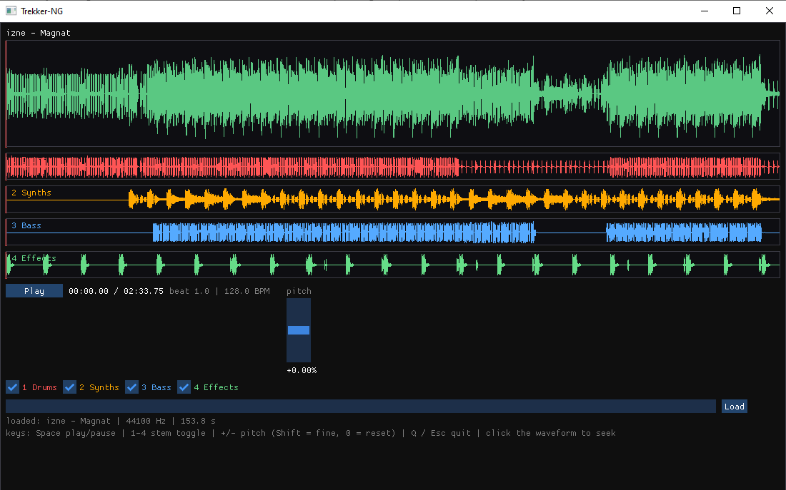

# Trekker-NG

Trekker-NG is a stem-based DJ player: it plays a track as four separate stems
(drums, bass, melody, vocals) through one sample-locked playhead, with
vinyl-style pitch control, stem muting, and click-free transport - like the
stem features of Traktor / djay, but for your own exported stems.

Written in C++17. Windows first (MSYS2/MinGW64); the engine is kept portable
so Linux/macOS can follow.

**Current status: M4 of 6 (in progress)** - M4a/M4b are in: the equal-power
crossfader with line/master gains and a two-deck audio path in the engine,
plus frame-accurate loops and cue points (parse + persistence). The UI is
still single-deck until M4c. The project is governed by [`SPEC.md`](SPEC.md).



| # | Milestone | Status |
|---|-----------|--------|
| **M1** | Pitch PoC (console): load stems, one playhead, per-stem mute, pitch ±10% with cubic Hermite | done |
| **M2** | Engine cleanup: rate smoothing, declick ramps, mixer extraction, unit tests | done |
| **M3** | ImGui UI, one deck, track-format loader, waveforms (composite + per-stem lanes) | done |
| **M4** | Second deck, crossfader, master section, hot cues, loops, beat display | in progress |
| **M5** | Polish: 3-band EQ, limiter, crossfader curves, settings | planned |
| **M6** | Packaging: Windows build, Linux AppImage, docs, example tracks | planned |

## Features

- **Four stems, one playhead** - all stems share a single fractional playhead,
  so they stay sample-locked forever (no phase drift between stems).
- **Pitch ±10 %** - cubic Hermite (Catmull-Rom) interpolation, with a per-sample
  rate smoothing (one-pole, 15 ms) so pitch moves glide instead of stepping.
- **Click-free by construction** - 5 ms transport fade (play/pause), 2 ms
  crossfade on cue jumps while audible, 5 ms gain ramps on stem mutes.
- **Master mixer stage** - atomic master gain + hard clamp, applied identically
  to live output and offline renders (limiter arrives in M5).
- **Input formats** - WAV, FLAC, MP3, OGG Vorbis (whatever miniaudio decodes);
  recommended exports are WAV or FLAC (MP3 delay/padding can misalign stems).
- **Load from a folder or a zip** - loose files, or a zip with an enclosing
  folder; `meta.json` supplies title/artist/BPM/stem colors.
- **Cue points & loops (engine)** - cues load from `meta.json` and persist
  edits (folder tracks rewrite `meta.json`, zip tracks get a `.cues.json`
  sidecar next to the archive); loops wrap on the exact crossing sample with
  the same 2 ms declick as a seek. Transport controls for both arrive in M4d.
- **Offline render mode** - render to WAV without a soundcard (`--render`),
  used for tests and automation.
- **ImGui UI with drag & drop** - drop a track folder or `.zip` anywhere on
  the window (or paste a path and press Load); the track hot-swaps into the
  running audio engine without a click or a restart.
- **Waveforms** - the composite (mixed) waveform on top plus four per-stem
  lanes below it, each in its stem color and dimmed while muted; all lanes are
  precomputed min/max peaks, share the playhead, and click-to-seek.
- **Self-contained download** - `trekker-ng.exe` + `SDL2.dll` only (everything
  else, including the C++ runtime, is statically linked).

## Quick start

### Run the prebuilt binary

```
dist\trekker-ng.exe examples\magnat.zip
```

or start it without arguments and **drag `examples/magnat.zip` onto the
window**. (`examples/magnat.zip` is a 4-stem example track:
`Drums/Synths/Bass/Effects` at 128 BPM.)

`dist\trekker-console.exe` is the old console front-end (same track argument,
plus the `--render` offline mode).

### Build from source

Requirements: [MSYS2](https://www.msys2.org/) with the **MINGW64** toolchain.
In a MINGW64 shell:

```
pacman -S mingw-w64-x86_64-toolchain mingw-w64-x86_64-cmake mingw-w64-x86_64-ninja
```

Then, inside the project directory (also MINGW64 shell):

```
./build.sh          # configure + build + run tests + copy to dist/
./build.sh release  # the same, plus dist/trekker-ng-<version>-win64.zip
```

The runnable result is `dist/` with `trekker-ng.exe` (UI), `trekker-console.exe`
and `SDL2.dll`. Failing tests block the build, so a `dist/` build is known-good.

## Running the example track

The repository ships `examples/magnat.zip` - a complete 4-stem demo track
(**izne - Magnat**, 128 BPM, 153.8 s, 44.1 kHz FLAC stems: Drums, Synths,
Bass, Effects), zipped with its `meta.json`:

```
dist\trekker-console.exe examples\magnat.zip
```

Startup prints what it loaded, then the key map (playback starts **paused** -
press `Space`):

```
track: Magnat - izne | 128.0 BPM | 44100 Hz | 153.8s
  stem 1: Drums        ok
  stem 2: Synths       ok
  stem 3: Bass         ok
  stem 4: Effects      ok

loaded: Magnat - izne | 44100 Hz | 4 stems
keys: Space play/pause | 1-4 stem toggle (Shift=solo) | A all on
      =+] pitch up | -_[ pitch down (Shift = 0.01%) | 0 reset | I interp | Q quit
```

While playing, a status line refreshes at the bottom:

```
[PLAY] Magnat | +0.00% (128.0 BPM) |  12.35/153.8s | 1:on 2:on 3:on 4:on
```

It shows play state, pitch, effective BPM, position and the 4 stem states.

Things to try:

1. `Space` - start; the 5 ms fade-in means no click at onset.
2. `1` `2` `3` `4` - drop each stem out and back (Drums, Synths, Bass,
   Effects); every toggle is ramped, never a pop.
3. `=` / `]` (or `-` / `[`) - pitch the whole track up/down together like a
   record, up to ±10 %. Hold `Shift` for 0.01 % micro-steps, `0` resets.
4. `Space` again to pause and resume - still click-free - and `Q` to quit.

No soundcard handy? The console front-end renders offline instead:

```
dist\trekker-console.exe examples\magnat.zip --render out.wav --rate 1.10 --seconds 6
```

## Command line

```
trekker-ng [track.zip | track-folder]     # UI: optional initial track
trekker-console <track.zip | track-folder> [options]   # console + --render

  --render <out.wav>  render offline to a WAV instead of playing (no soundcard)
  --rate <x>          playback rate for --render (e.g. 1.10 = +10%)
  --seconds <n>       seconds to render (default 5)
  --stems <bbbb>      4-bit stem mask to keep on while rendering (default 1111)
  --help              show usage
```

Example - render 6 seconds of the example track at -7 %, only drums and bass:

```
dist\trekker-console.exe examples\magnat.zip --render out.wav --rate 0.93 --seconds 6 --stems 1100
```

## Keyboard control (UI)

| Key | Action |
|-----|--------|
| `Space` | play / pause (at track end: restart) |
| `1` `2` `3` `4` | toggle stem on/off |
| `=` `+` `]` | pitch **up** 0.10 % (hold `Shift`: 0.01 %) |
| `-` `_` `[` | pitch **down** 0.10 % (hold `Shift`: 0.01 %) |
| `0` | reset pitch to 0.00 % |
| `Q` / `Esc` | quit |

Click any waveform lane to seek; drag & drop a track folder or `.zip` anywhere
to load. The vertical fader works like real DJ gear: **up = slower, down =
faster** (the keyboard steps move the fader too). Load accepts a pasted path.

## Keyboard control (console live mode)

| Key | Action |
|-----|--------|
| `Space` | play / pause (at track end: restart) |
| `1` `2` `3` `4` | toggle stem on/off |
| `Shift+1..4` (or `!@#$` on US layout) | solo stem (press again to unsolo) |
| `A` | all stems on |
| `=` `+` `]` | pitch up 0.10 % per press (hold `Shift`: 0.01 %) |
| `-` `_` `[` | pitch down 0.10 % per press (hold `Shift`: 0.01 %) |
| `0` | reset pitch to 0.00 % |
| `I` | toggle interpolator: cubic Hermite / linear (debug) |
| `Q` / `Esc` | quit |

In the UI, loading happens any time - the track is prepared on a worker
thread and hot-swapped into the running audio engine (SPEC §4.7).

## Track format

A track is a folder (or zip) containing up to 4 stereo audio files plus a
`meta.json`:

```
mytrack/
  meta.json
  drums.flac
  bass.flac
  melody.flac
  other.flac
```

```json
{
  "title": "Magnat",
  "artist": "izne",
  "bpm": 128.0,
  "stems": [
    { "name": "Drums",  "file": "drums.flac", "color": "#ff5555" },
    { "name": "Bass",   "file": "bass.flac",  "color": "#55ff55" },
    { "name": "Melody", "file": "melody.flac","color": "#5555ff" },
    { "name": "Vocals", "file": "other.flac", "color": "#ffff55" }
  ]
}
```

All files must be stereo and share one sample rate/length (missing stems are
simply silent). Full details: [`docs/FORMAT.md`](docs/FORMAT.md).

## Architecture

```
src/
  engine/            no UI dependencies; builds as static libtrekker_engine
    deck.{h,cpp}             4 stems, one playhead, smoothing + declick, loops
    interpolate.{h,cpp}      pure Hermite / linear interpolator
    mixer.{h,cpp}            line/cross/master gains, equal-power curve, clamp
    track_loader.{h,cpp}     folder/zip -> DeckData, meta.json, cue persistence
    audio_device.{h,cpp}     miniaudio device, realtime callback
  ui/                M3 ImGui + SDL2 front-end (main loop, deck view)
  console/           M1/M2 console front-end (kept as trekker-console)
tests/               doctest suite (SPEC §9), run automatically by build.sh
tools/               manual acceptance helpers (test-track generator)
examples/            example track
docs/                FORMAT.md, USAGE.md, ui-m3.png (screenshot)
third_party/         vendored: miniaudio, miniz, nlohmann/json, doctest, imgui
```

Realtime rules (SPEC §4.7): the audio callback may not allocate, lock, do IO,
log, or throw. UI -> engine communication is atomics only (targets, stem
mutes, seek requests); the `tests/` suite enforces the no-allocation rule
with a global `operator new` counter.

Libraries (SPEC §3): **miniaudio** (device, decode, WAV encode), **miniz**
(zip), **nlohmann/json** ("meta.json"), **doctest** (tests), **Dear ImGui**
(UI, vendored) + **SDL2** (window/GL, from pacman).

## Testing

```
./build.sh        # builds and runs the whole suite via ctest
```

The suite (SPEC §9) runs headless - no soundcard, no Python, everything is
synthesized in memory:

1. **Pitch accuracy** - 440 Hz sine at rate 1.10 measures 484 Hz ±0.5
2. **Stem lock** - 10 simulated minutes at 8 kHz under a random rate schedule;
   click peaks must stay inside their playhead-predicted windows (no drift)
3. **Mute ramp** - stem toggles never jump the waveform above the threshold
4. **Jump declick** - seek while playing is discontinuity-free
5. **Interpolator** - integer positions are bit-identical; rate 1.0 output
   equals the input byte-for-byte
6. **Realtime safety** - the render path performs zero heap allocations
   (plus transport pause/resume, loops and mixer checks)
7. **Loops & cues** - loop wraps land on the crossing sample, stay click-free
   and reject bad ranges; cue arrays parse/round-trip with unknown
   `meta.json` fields preserved

Manual acceptance (SPEC §9): listen at ±10 % on real music - it should sound
like pitching a record, with no warble, phasing, or digital smear.

## Documentation

- [`SPEC.md`](SPEC.md) - the governing specification (features, rules, milestones)
- [`docs/USAGE.md`](docs/USAGE.md) - end-user usage guide
- [`docs/FORMAT.md`](docs/FORMAT.md) - track folder/zip and `meta.json` reference

